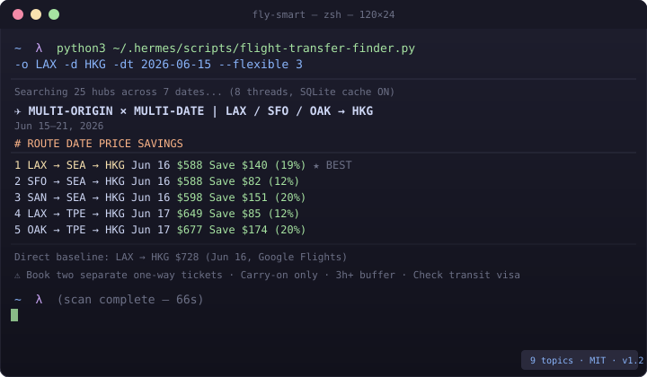

# fly-smart

> **Find cheaper flights using hidden-city arbitrage** — no API key, no browser, just smarter routing across 70+ global hubs.

[](https://github.com/wali-reheman/fly-smart/community)
[](https://github.com/wali-reheman/fly-smart/blob/main/LICENSE)
[](https://github.com/topics/flights)

---

## Demo



*Scanning 7 dates × 25 hubs in 66 seconds — finding routes Google Flights doesn't surface directly.*

---

## How It Works

Airlines price routes based on demand and competition — not just distance. This creates **pricing arbitrage**: flying A → hub → B can be cheaper than A → B direct. `fly-smart` finds these combos by scanning 70+ global hubs.

---

## One-Line Setup

```bash
pip install fast-flights
```

Or use it through **Hermes Agent** by asking naturally:

> "search flights from LAX to HKG on June 15"

---

## Quick Start

```bash
# Find the cheapest transfer route
python3 ~/.hermes/scripts/flight-transfer-finder.py -o LAX -d HKG -dt 2026-06-15

# Scan ±3 days around your date
python3 ~/.hermes/scripts/flight-transfer-finder.py -o LAX -d HKG -dt 2026-06-15 --flexible 3

# Compare multiple airports at once
python3 ~/.hermes/scripts/flight-transfer-finder.py -o LAX,SFO,OAK -d HKG -dt 2026-06-15 --flexible 3
```

## What It Finds

```
✈ MULTI-ORIGIN × MULTI-DATE  |  LAX / SFO / OAK → HKG
                         Jun 15–21, 2026
─────────────────────────────────────────────────────────────
  [ 1]  LAX → SEA → HKG   Jun 16   $588   Save $140 (19%)  ★ BEST
  [ 2]  SFO → SEA → HKG   Jun 16   $588   Save $82  (12%)
  [ 3]  SAN → SEA → HKG   Jun 16   $598   Save $151 (20%)
  [ 4]  LAX → TPE → HKG   Jun 17   $649   Save $85  (12%)
  [ 5]  OAK → TPE → HKG   Jun 17   $677   Save $174 (20%)
─────────────────────────────────────────────────────────────
```

---

## Features

| | |
|---|---|
| **70+ global hubs** | Northeast Asia, China, SEA, Middle East, Europe, US coasts |
| **Multi-date** | Scan ±7 days in parallel |
| **Multi-origin** | Compare LAX, SFO, SAN, SJC, OAK simultaneously |
| **SQLite cache** | 1-hour TTL — same routes are instant on repeat |
| **Rule verification** | `--verify-rules` checks 3h buffer and transit visa |
| **CSV / Notion export** | `--export-csv` or `--export-notion` |
| **Price alerts** | `--alert-below $600` for cron-style monitoring |

---

## Full Options

```bash
# Alert if any deal drops below $X
--alert-below 600

# Verify self-transfer rules (3h buffer, transit visa)
--verify-rules

# Export to CSV
--export-csv --csv-output ~/deals.csv

# Export to Notion (set NOTION_FLIGHT_DEALS_DB_ID + NOTION_API_KEY)
--export-notion --notion-database <db-id>

# Scan all 70+ hubs instead of 25
--all-hubs

# Passengers / cabin
-p 3 -c business
```

---

## Self-Transfer Rules

> ⚠️ These deals require **two separate one-way tickets**.

- ✅ **Two separate bookings** — not as a round-trip
- ✅ **Carry-on only** — no checked bags (they won't transfer between tickets)
- ✅ **3+ hour buffer** between connecting legs
- ✅ Check **transit visa** requirements for the hub country

---

## Installation

```bash
# Clone
git clone https://github.com/wali-reheman/fly-smart.git ~/.hermes/skills/repos/wali-reheman/fly-smart

# Set up environment
python3 -m venv ~/.hermes/venvs/flight-search
~/.hermes/venvs/flight-search/bin/pip install fast-flights
```

---

## Contributing

PRs welcome! See [CONTRIBUTING.md](CONTRIBUTING.md).

---

## License

MIT — see [LICENSE](LICENSE)
